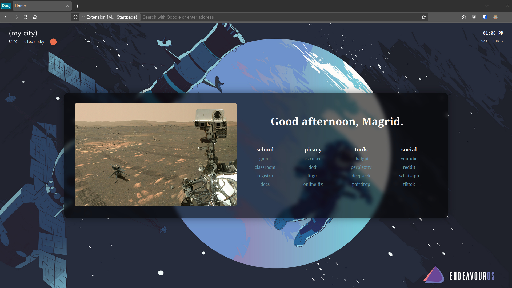

# Startpage

Feel free to fork and make your own changes!



A Firefox new tab / homepage override. Vanilla HTML, CSS and JavaScript, no
build step: the folder in `magrid-startpage-extension/` is the extension.

## Settings menu

The start page has a gear button in the bottom right corner, and `shift` + `s`
opens the same menu. Everything in it is stored by the browser
(`storage.local`) and the wallpaper image in IndexedDB, so **you never have to
edit code and resubmit to addons.mozilla.org to change how it looks**. Settings
survive extension updates.

| Tab | What it does |
| --- | --- |
| Presets | Your saved looks as a gallery: save the look on screen under a name, then click a card to bring it back, update it, rename it or delete it. |
| Appearance | Colours for text, category titles, bookmarks (normal, hover, visited) and the clock/weather widgets. Font family and sizes. Panel opacity and backdrop blur. Layout: columns, spacing, category width, panel width, corner rounding. Your name and the greeting wording. |
| Wallpaper | Pick a local image or use an image URL, and remove it again. A picture over 2 MB is made smaller to fit the screen, and the tab says so. A picked image that something else has replaced can be brought back with one button. A slider darkens the wallpaper behind the text. |
| Widgets | Show/hide the clock and the weather, 12/24 hour format, extra time zones and a date format for the clock, the weather city and OpenWeatherMap API key, and an opt-in forecast under the weather. |
| Bookmarks | Add, rename, delete, reorder and edit categories and bookmarks. Drag to reorder, or use the arrow buttons. Dropping a bookmark on another category moves it. The editor points out what needs a second look: a bookmark with no address or no name, two that share an address, a category that holds nothing. An address typed without a scheme grows one automatically, and the hint says what it became. |
| Data | Export/import the whole configuration as JSON, or reset to defaults. A reset and every other destructive action offer an Undo in the toast for a few seconds, so nothing is gone until you let it be. |

Colours, blur, opacity and font sizes apply live, so you can see the effect
while the menu is open.

**No wallpaper is bundled.** The whole extension is about 190 kB of plain files
(about 50 kB in the zip that gets uploaded), and the page starts on a flat
background colour until you pick a picture in the Wallpaper tab. While there is
no wallpaper, the gear button pulses gently to point at it.

**A large picture is made smaller.** A wallpaper is only ever seen scaled to
fill the screen, so most of an 8 MB picture from a phone is pixels no display
can show, and all of them are decoded again on every new tab. A picked picture
over 2 MB is stored as WebP at no more than 2560 pixels on its longest edge: a
4032×3024 photo goes from 15.9 MB to 1.7 MB, with no visible difference, since
the screen cannot show one. The Wallpaper tab says when this happened and what it
became. Everything else is stored exactly as you picked it — a small picture
keeps its own bytes, and nothing is ever made larger.

## Presets

The Presets tab is the first one you see, because switching between looks is the
thing you do most.

**Your own looks.** Set up a look you like, type a name above the gallery and
save it. It turns up as a card showing what that look actually looks like: its
background, the panel sitting on it, and a few words in its own colours. From
there a card is `Use it`, `Update` (overwrite it with the look on screen right
now), or `Delete`. The arrows on a card move it earlier or later in the
gallery, the way the bookmark editor reorders categories. The name field on the
card is the rename, so there is no dialog to keep in step with the gallery.
Deleting a card is not final either: the toast carries an Undo for a few
seconds, and both the card and the look it brought with it come straight back.

A preset captures the colours, the panel and the background, and deliberately
nothing else. Your fonts, sizes, greeting and bookmarks are not part of one and
are left alone, so a look can never drag your page out of shape.

**One picture, however many looks want it.** Every image you pick goes into a
library in IndexedDB under an id of its own, and a preset points at that id
rather than holding a copy. Two looks that share a wallpaper cost one file
between them. A picture nothing points at any more is deleted for you, so the
library does not grow quietly. The one exception is deliberate: applying a
preset only *sets aside* the picture you had, and the Wallpaper tab brings it
back with one button. Removing the wallpaper is how you really delete it.

Deleting a preset or removing the wallpaper leaves the picture behind for the
length of the undo window, so the toast's Undo has the file to point at again.
Only the sweep that runs once that window is closed takes a picture nothing
points at any more, and it re-checks what the settings use first — a picture an
undo brought back is left alone.

A picture preset copied from another browser has no file here, so that card says
so and keeps the background you already have rather than blanking the page.

Presets are stored in the settings JSON and travel with an export. The
pictures do not: an export carries the colours, the panel and *which* image each
preset used, and importing it on another browser leaves the cards marked as
missing their picture rather than failing.

## Layout

Appearance → Layout has five sliders:

- **Bookmark columns** — the categories wrap onto as many rows as they need.
  Left at `any` they stay in one row for as long as they fit, which is what the
  extension has always done.
- **Space between them** — the gap the column count is built from, so the two
  work together.
- **Category width** — how wide each category is. Left at `default` it is the
  180 px the extension has always used; a number pins the width whatever the
  bookmarks in it need.
- **Panel width** — `fits` hugs the bookmarks as they are; a number pins the
  width however many bookmarks are in it. The padding is included, so the
  number is the width you actually see.
- **Corner rounding** — including `0` for square corners.

## The widgets

Everything a widget can do beyond its plain default is off until you ask for it.

- **Extra time zones** — the main clock is always your own time. Every zone you
  add from the list gets its own small clock under the main one, so the page can
  answer "what time is it at home?" while you are away. Give a zone a title and
  that is what its line shows; leave it empty and the zone name is used. Empty by
  default, so a default tab shows one clock. A zone the browser does not know is
  quietly dropped.
- **Date format** — "Your locale's short date" keeps what the browser already
  does. The other choices are clear arrangements of the day, month and year
  (`Day / Month / Year`, `Day.Month.Year`, `Month Day, Year`, ...). Under the
  choices a line previews the main clock exactly as the corner widget will show
  it, so the result is visible before you close the menu.
- **Forecast** — off by default, so a default tab makes no forecast call at
  all. `Next 12 hours` lists the coming four three-hour steps with their icons;
  `Next 3 days` gives each day's low and high. Both come from the same
  OpenWeatherMap account and key as the current conditions. If the forecast
  cannot load, the row quietly disappears and the conditions stay.

## The greeting

Appearance → Greeting has your name and a wording template. `{greeting}` becomes
good morning, afternoon, evening or night, and `{name}` is the name:

```
{greeting}, {name}.        Good evening, Magrid.
Hi {name}, the time is {greeting}.    Hi Magrid, the time is Good evening.
Hello!                    Hello!  (constant, no time awareness)
                          (blank: no greeting at all)
```

## Filtering bookmarks

Start typing anywhere on the page, or press `/`, and the list narrows to the
bookmarks whose title or address matches, with the matched part highlighted and
a count beside the box. Categories with nothing left in them are hidden.
`escape` clears the filter, and a second `escape` puts the list back. Nothing is
stored, so a reload always starts whole.

While the list is narrowed, the arrow keys walk the matches — the highlight
wraps around the ends, the mouse can point at one instead, and `enter` opens the
bookmark you are standing on. `alt` + `enter` opens it in a new tab. These keys
only steer the highlight while the filter is narrowing the list; with the list
left alone they do nothing.

Lower case letters are all free for this, which is why the settings menu is on
`shift` + `s` and not `s`.

Notes:

- Settings live in the browser profile. Uninstalling the extension deletes
  them, so use **Data → Export** to keep a copy (and to move your setup
  between a temporary install and a signed one).
- A picked wallpaper is stored as a blob in IndexedDB, not in the JSON export
  (`storage.local` only has a few MB to spend, and base64 inflates by a third).
  An image URL is exported, the image behind it is not. A gradient background is
  plain text, so it exports like everything else.
- The blob in IndexedDB is the made-smaller version, not your original file, so
  the file on your disk is the only copy at full size. Re-encoding happens once,
  when you pick a picture.
- The weather city is looked up through OpenWeatherMap's geocoding API, so
  changing it needs a network connection. The first lookup is cached with its
  coordinates.

## What the page does not do

A new tab is opened, looked at, and closed, so the page spends its time doing
almost nothing. The things it deliberately does not do:

- **The settings menu is not built until it is opened.** The markup is in
  `index.html` either way, so a closed menu costs nothing extra. A new tab with
  eight saved looks makes one object URL and leaves 261 nodes, where it used to
  make fifteen and leave 531 — the whole menu, a card and a fresh preview for
  every look, drawn for a menu nobody opened.
- **A change only redraws the part it affects.** The inputs, the wallpaper note,
  the bookmark editor and the preset gallery are drawn from four different
  corners of the settings, so changing one colour does not rebuild the other
  three or read the wallpaper out of storage again.
- **A custom property that already holds its value is not written back.** Every
  property the settings drive is read by the whole page, so writing all
  thirty-six of them for one colour change made the browser recalculate the
  page's style for nothing. One change is now one write.
- **The picture is not read out of storage for an unrelated change.** Dragging a
  slider does not go back to IndexedDB for a wallpaper that has not moved.
- **The clock wakes up once a minute, not once a second.** It formats with
  built-once `Intl` formatters, and only writes text that changed. A tab left
  open overnight pays 7 ms of main thread for the clock instead of 196 ms.

Measured in Firefox with the real extension loaded and a wallpaper set, first
contentful paint went from 27 ms to 21 ms. Load time is dominated by parsing the
document and reading the settings, both of which are already about as small as
they can be: moving the settings markup out of `index.html` into a file fetched
on first use was measured at 0 ms, so that is not done.

## The wallpaper is on screen before the first paint

A new tab used to open on a frame of flat colour. The stylesheet's `--wallpaper`
is a transparent layer until the settings and the picture come back from
storage, and on a cold start that is a frame or two after the page has already
painted — so the tab showed the background colour, then the wallpaper.

The picture is now cached in `localStorage` as a data URL, and `boot.js` reads
it while the page is still parsing and sets `--wallpaper` before the first
paint. `localStorage` is the one thing a page can read at that point, which is
the only way to beat the flat frame: the picture is in the stylesheet early
enough that the browser decodes it while it paints, so the first paint is the
wallpaper.

The cache is a copy, not the store — the picture itself still lives in
IndexedDB, and the cache is rewritten every time the wallpaper changes and
dropped when it is not a picture any more (a URL, a gradient, or none). If it
is missing or storage is blocked, the picture still arrives the ordinary way,
one frame later.

Measured over a cold start with the real extension loaded, the flat frame went
from about 17 ms to about 2 ms, and the first paint was the wallpaper on every
run rather than on none.

## Development

Load `magrid-startpage-extension/` as a temporary add-on
(`about:debugging` → *This Firefox* → *Load Temporary Add-on…*) and tick
**Allow access to file URLs** if you want to point the picker at local images.

`./update-zip.sh` zips the extension folder into
`magrid-startpage-extension.zip`, which is what gets uploaded to
addons.mozilla.org, then commits and pushes whatever changed.

Files:

| File | Role |
| --- | --- |
| `boot.js` | Reads the cached wallpaper while the page is still parsing, so the first paint is the wallpaper. |
| `settings.js` | Settings schema, defaults, persistence, wallpaper storage, applying values as CSS variables. |
| `settings-ui.js` | The settings menu: forms, preset buttons, bookmark editor, import/export. |
| `bookmarks.js` | Bookmark model and rendering of the categories. |
| `filter.js` | Type to filter the bookmark list on the page. |
| `clock.js`, `weather.js`, `greeting.js` | Widgets. All three read the settings menu. |
| `style.css` | The start page itself. Colours, fonts, opacities and layout are CSS variables with the defaults in `:root`. |
| `settings.css` | Styling for the settings menu. |

To add a new setting: add the key to `DEFAULTS` and to `sanitize()` in
`settings.js`, add a `--variable` default to `:root` in `style.css`, apply it
in `applyTheme()`, then add an input with `data-setting="your.key"` in
`index.html`. No other wiring needed. A setting that is not a CSS variable (the
name, the clock format, whether a widget is on) is read by its widget through
`Settings.get()` and repainted through `Settings.subscribe`.

Values arriving from a settings file are all filtered by `sanitize()`, which is
why a bad value falls back to the default instead of reaching the page. The
wallpaper gradient is the one place a free-form string goes straight into a CSS
property, so it is checked against a whitelist of gradient functions first.
